

  

<h1 align="center">Mint Leaf</h1>

  <strong>Your personal finance companion.</strong> 
  Track spending, set budgets, and stay in control.

  
  
  
  
  

  

## Star History

<a href="https://www.star-history.com/?repos=Kolomaster68%2Fmint-leaf&type=date&legend=top-left">
 <picture>
   <source media="(prefers-color-scheme: dark)" srcset="https://api.star-history.com/chart?repos=Kolomaster68/mint-leaf&type=date&theme=dark&legend=top-left" />
   <source media="(prefers-color-scheme: light)" srcset="https://api.star-history.com/chart?repos=Kolomaster68/mint-leaf&type=date&legend=top-left" />
   
 </picture>
</a>

---

  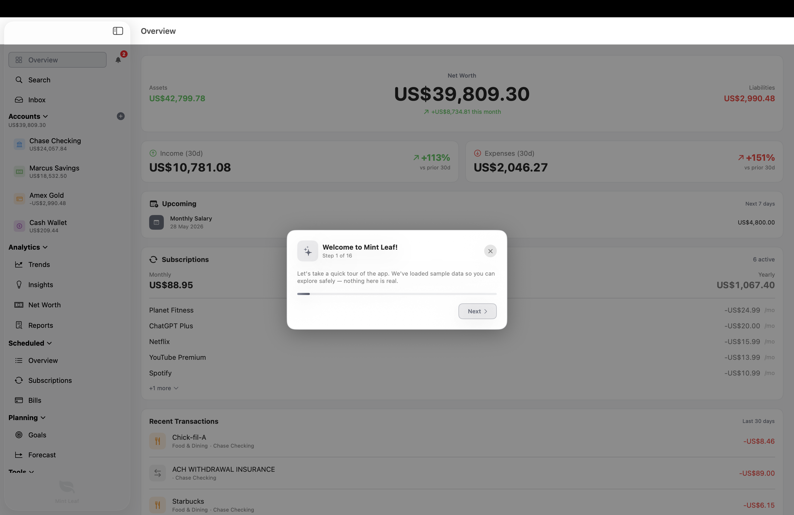

## What's New in v2.0

- **Search** — Find any transaction instantly by name, category, account, notes, or amount
- **Notification Centre** — In-app alerts for overdue bills, exceeded budgets, and upcoming payments
- **Multi-Currency Support** — 39 currencies with automatic formatting and per-account currency
- **Keyboard Shortcuts** — Navigate the app with `Cmd+1-5`, `Cmd+F`, `Cmd+B`, `Shift+Cmd+N`
- **Reorganised Sidebar** — Grouped into Overview, Accounts, Analytics, Scheduled, Planning, and Tools
- **Dashboard Upcoming Bills** — See what's due in the next 7 days at a glance
- **Net Worth in Sidebar** — Total net worth displayed under your accounts
- **Subscription Calendar** — Swipe-to-dismiss drawer, pause/resume subscriptions
- **Updated Onboarding** — Refreshed 16-step guided tour covering all new features
- **Consistent UI** — Proper padding across all sheets and popups

## Features

- **Multiple Accounts** — Track checking, savings, credit cards, and cash with live balances
- **Powerful Search** — Find transactions by name, category, account, notes, or amount with filters
- **Transaction Inbox** — Review and categorise uncategorised transactions in one place
- **Budgets** — Set monthly spending limits by category and track progress in real time
- **Trends & Analytics** — Visualise spending patterns over time with interactive charts
- **Smart Insights** — Cashflow forecasts, anomaly detection, and spending summaries
- **Notification Centre** — Stay on top of due bills, exceeded budgets, and overdue items
- **Scheduled Transactions** — Manage recurring bills, subscriptions, and income on a calendar
- **Rules & Automation** — Auto-categorise transactions with pattern matching and merchant aliases
- **Multi-Currency** — Support for 39 currencies with automatic formatting
- **CSV & PDF Import** — Import bank statements from CSV files or PDF documents
- **Keyboard Shortcuts** — Full keyboard navigation for power users
- **Interactive Tutorial** — Guided 16-step tour with sample data to learn the app
- **Privacy First** — All data stays on your device

## Screenshots

### Light Mode

<table>
  <tr>
    <td align="center"> <strong>Overview Dashboard</strong></td>
    <td align="center">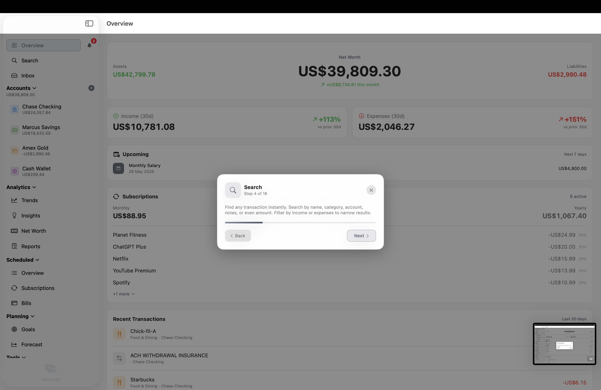 <strong>Search</strong></td>
  </tr>
  <tr>
    <td align="center">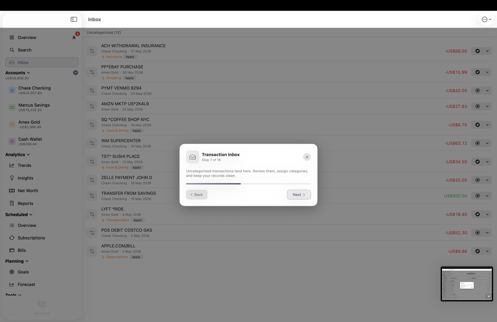 <strong>Transaction Inbox</strong></td>
    <td align="center">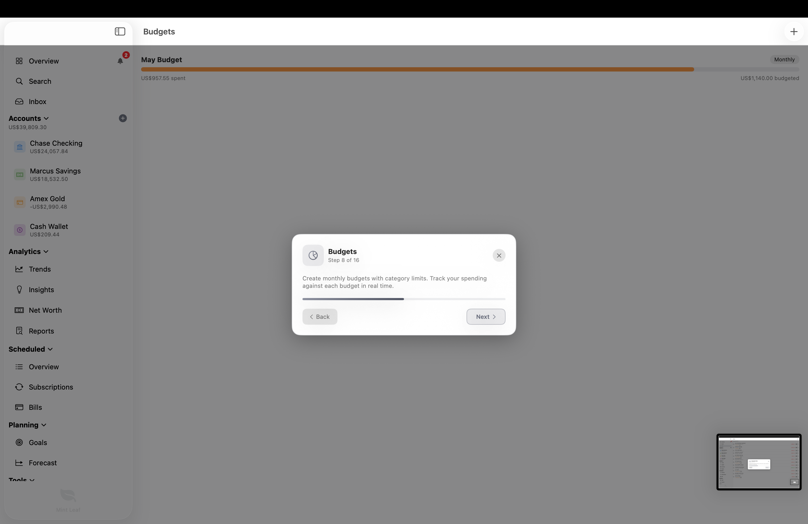 <strong>Budgets</strong></td>
  </tr>
</table>

### Dark Mode

<table>
  <tr>
    <td align="center">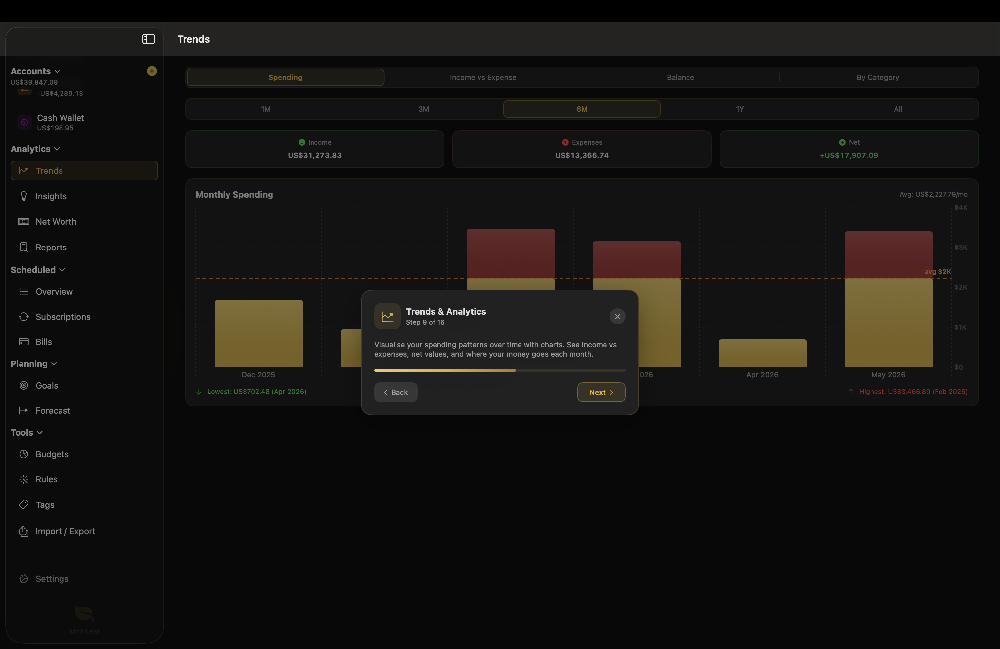 <strong>Trends & Analytics</strong></td>
    <td align="center">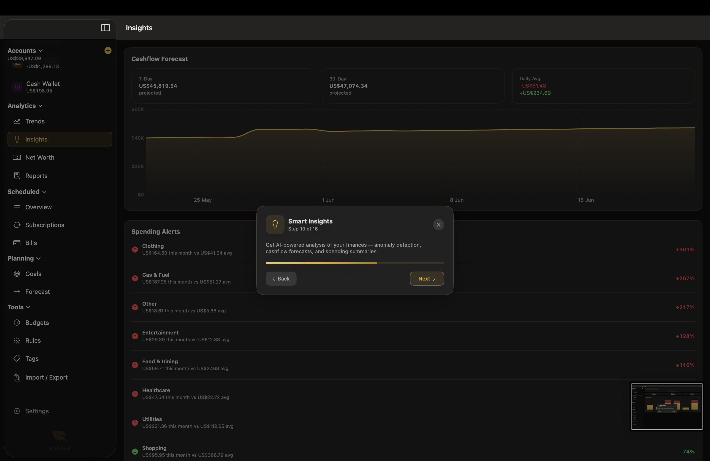 <strong>Smart Insights</strong></td>
  </tr>
  <tr>
    <td align="center">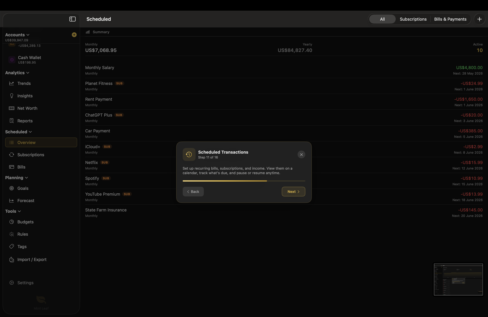 <strong>Scheduled Transactions</strong></td>
    <td align="center">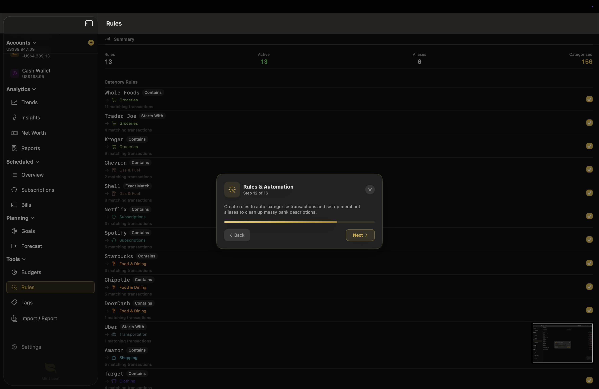 <strong>Rules & Automation</strong></td>
  </tr>
</table>

## Installation

### Download DMG (Recommended)

1. Download the latest `.dmg` from [Releases](https://github.com/Kolomaster68/mint-leaf/releases/latest)
2. Open the DMG and drag Mint Leaf to your Applications folder
3. On first launch, right-click the app and select **Open** (macOS Gatekeeper requires this for unsigned apps)

### Build from Source

1. Clone the repository
2. Open `MintLeaf.xcodeproj` in Xcode 15+
3. Select the `MintLeaf_macOS` or `MintLeaf_iOS` scheme
4. Build and run

No external dependencies required.

## Onboarding

New users are guided through a polished onboarding flow with three options:

1. **Start Fresh** — Jump straight into the app
2. **Load Sample Data & Take a Tour** — Explore with demo data and a guided 16-step walkthrough
3. **Load Sample Data** — Demo data without the tour

<table>
  <tr>
    <td align="center">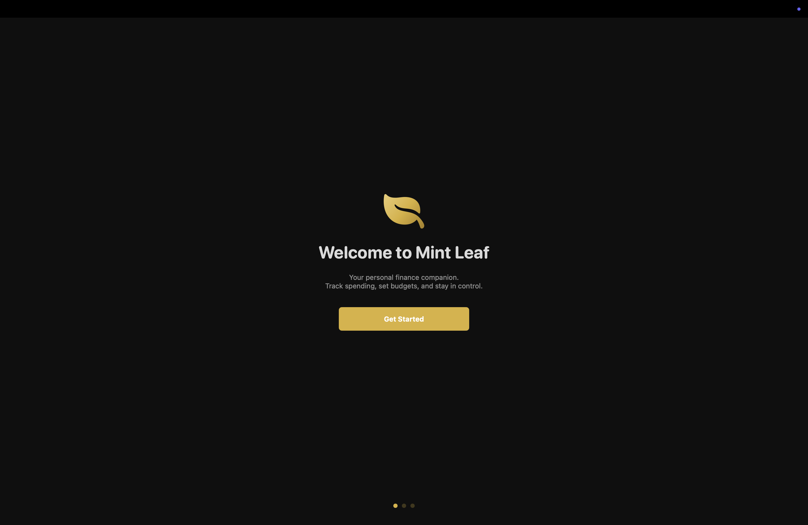 <strong>Welcome</strong></td>
    <td align="center">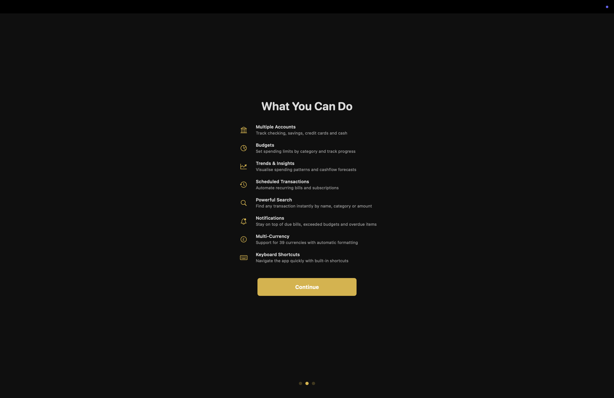 <strong>Features Overview</strong></td>
  </tr>
  <tr>
    <td align="center">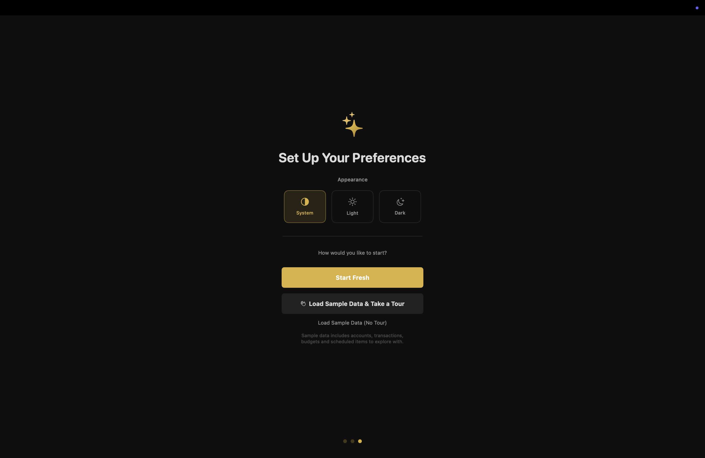 <strong>Setup (Dark)</strong></td>
    <td align="center">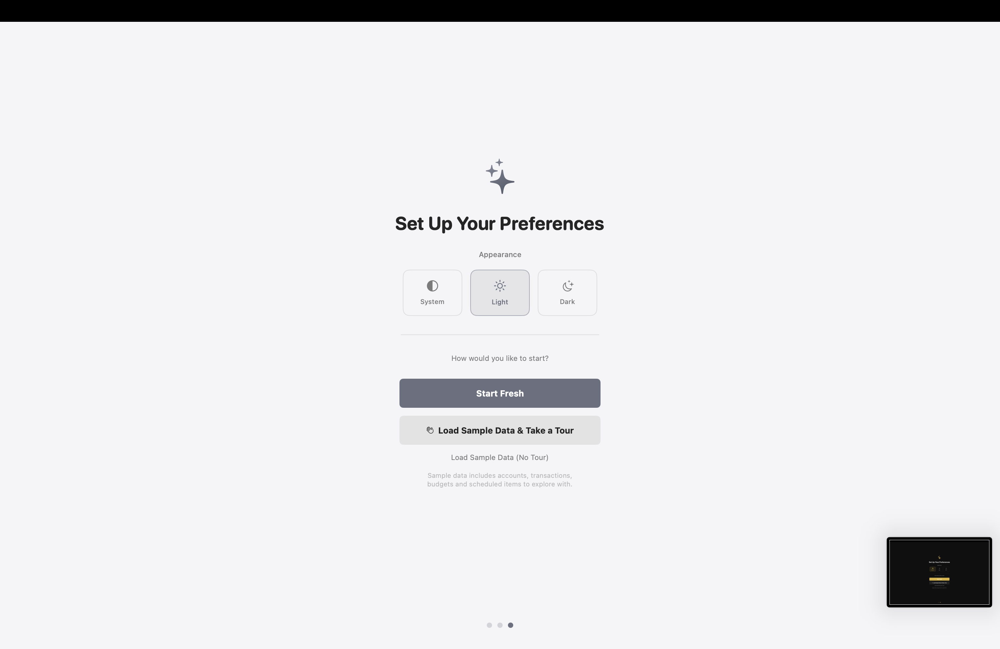 <strong>Setup (Light)</strong></td>
  </tr>
  <tr>
    <td align="center">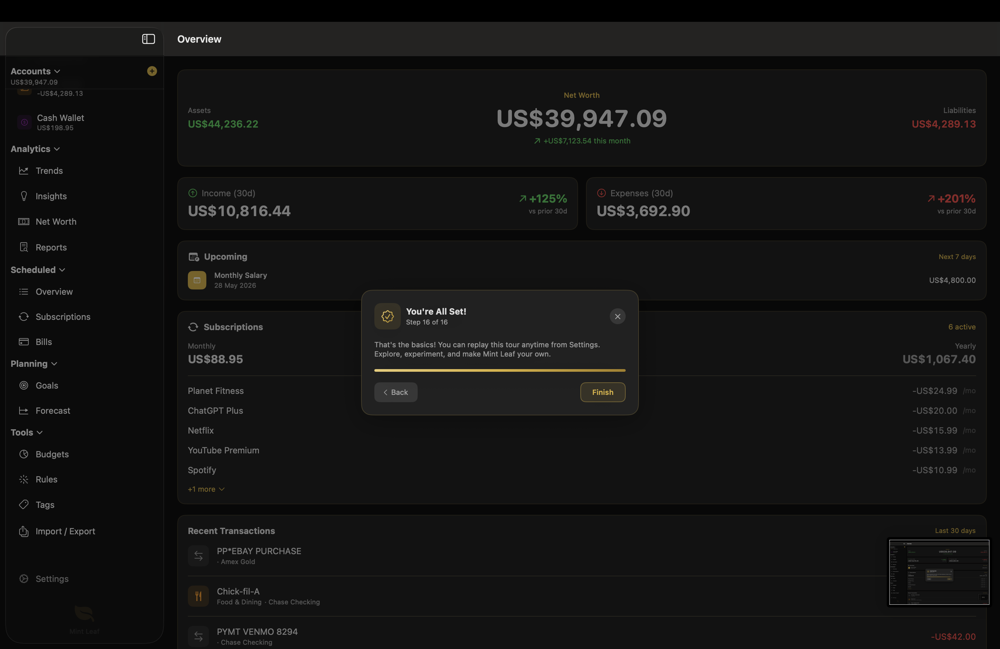 <strong>Tour Complete</strong></td>
    <td align="center">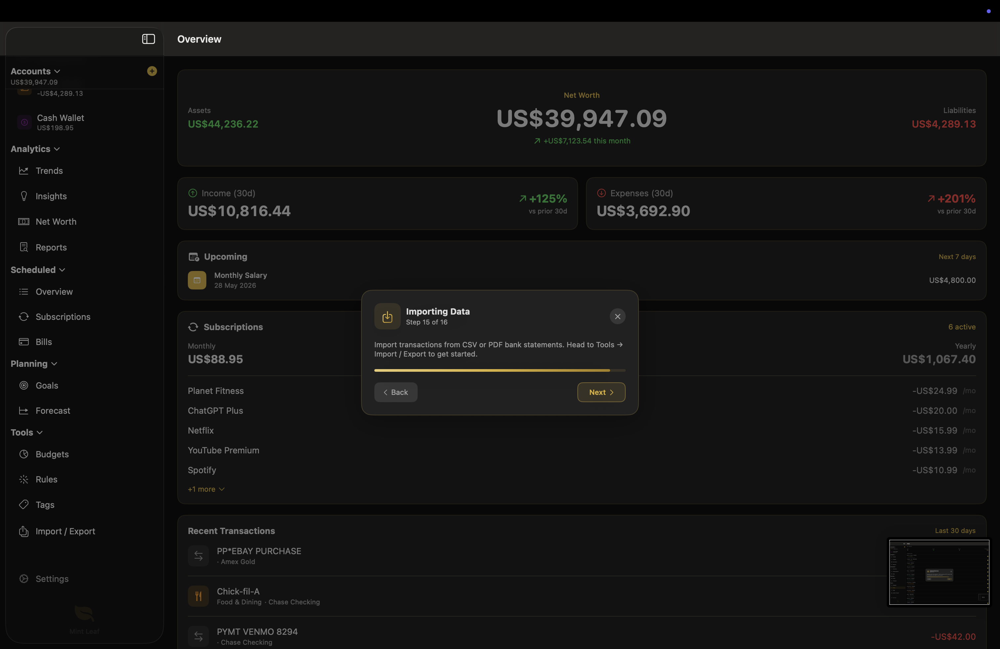 <strong>Guided Tour</strong></td>
  </tr>
</table>

## Keyboard Shortcuts

| Shortcut | Action |
|----------|--------|
| `Cmd+1` | Overview |
| `Cmd+2` | Inbox |
| `Cmd+3` | Trends |
| `Cmd+4` | Budgets |
| `Cmd+5` | Scheduled |
| `Cmd+F` | Search |
| `Cmd+B` | Notifications |
| `Shift+Cmd+N` | New Account |

## App Icon

Mint Leaf ships with both light and dark app icons that match the system appearance. Users can also switch between them manually or upload a custom icon from Settings.

  
  &nbsp;&nbsp;&nbsp;&nbsp;
  

## Tech Stack

| Component | Technology |
|-----------|-----------|
| UI | SwiftUI 5 |
| Data | SwiftData |
| Platform | macOS 14+ / iOS 17+ |
| Language | Swift 5.9+ |
| Architecture | MVVM with @Observable |

## Roadmap

Mint Leaf is under active development. Here's what's planned:

| Status | Feature |
|--------|---------|
| :white_check_mark: | **Multi-Currency Support** — 39 currencies with automatic formatting |
| :white_check_mark: | **Search** — Full transaction search with filters |
| :white_check_mark: | **In-App Notifications** — Alerts for bills, budgets, and overdue items |
| :white_check_mark: | **Keyboard Shortcuts** — Full keyboard navigation |
| :white_check_mark: | **DMG Distribution** — macOS release for direct download |
| :construction: | **Net Worth Tracker** — Historical net worth chart and breakdown |
| :construction: | **Receipt Scanning** — Attach photos or scan receipts |
| :date: | **Push Notifications** — System notifications for upcoming bills |
| :date: | **Export Reports** — Generate PDF and Excel summaries |
| :date: | **Widgets** — At-a-glance spending and balance widgets |
| :date: | **Shared Budgets** — Collaborate on budgets with family |
| :date: | **Goal Tracking** — Set savings targets and track progress |
| :date: | **Apple Watch App** — Quick balance checks from your wrist |
| :date: | **Bank Integration** — Connect accounts via Plaid or Open Banking |

:white_check_mark: = Done &nbsp; :construction: = In Progress &nbsp; :date: = Planned

Have a feature request? [Open an issue](https://github.com/Kolomaster68/mint-leaf/issues).

## License

MIT License. See [LICENSE](LICENSE) for details.
