

  

<h1 align="center">Mint Leaf</h1>

  <strong>Your personal finance companion.</strong> 
  Track spending, set budgets, forecast your finances, and stay in control.

  
  
  
  
  

  

## Star History

<a href="https://www.star-history.com/?repos=Kolomaster68%2Fmint-leaf&type=date&legend=top-left">
 <picture>
   <source media="(prefers-color-scheme: dark)" srcset="https://api.star-history.com/chart?repos=Kolomaster68/mint-leaf&type=date&theme=dark&legend=top-left" />
   <source media="(prefers-color-scheme: light)" srcset="https://api.star-history.com/chart?repos=Kolomaster68/mint-leaf&type=date&legend=top-left" />
   
 </picture>
</a>

---

  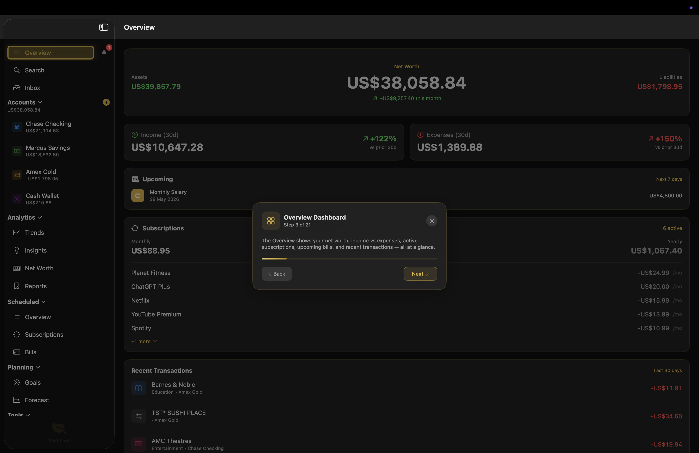

## What's New in v4.0

v4.0 is a major release focused on **credit cards, account safety, and trust**.

### Credit Card Statement Cycles

- Track each card's **statement day** and **payment due date** — a number of days after the statement, or a fixed day of the month, picked from a calendar grid
- A dashboard **Credit Card Payments** card shows the statement balance, what's still owed, and a live countdown — and floats to the top with an attention border when a payment is near
- **Reminders** as the due date approaches, when it's due, and if it's overdue
- **Auto-reconcile** — when the payment lands, the statement is marked paid and the reminders clear themselves

### Overdrafts & Fee Estimates

- Overdraft **usage bar** and true **available-to-spend** on current accounts
- Configure your **arranged limit, EAR, unarranged fee**, and a card's **purchase APR**
- Plain-English **fee estimates before they hit** — insufficient-funds warnings and "pay in full to avoid interest" nudges. Estimates only; nothing is ever posted as a transaction

### Backups & Data Health

- **Automatic daily backups**, keeping the 10 most recent, plus full **backup/restore** to a portable JSON file (accounts, transactions, subscriptions, bills, budgets, goals, rules and tags — relationships preserved)
- A new **Data Health** screen reconciles every balance, finds **duplicate** and **orphaned** transactions, and offers **one-tap fixes** — surfaced as a banner on the Overview if a balance ever drifts

### Also New Since v3.0

- **Bank File Import** — OFX, QFX, and QIF files from most banks, with preview, duplicate detection, and auto-categorisation
- **Financial Health** dashboard card with a savings-rate, debt-ratio, and overall score
- **Location tagging** on transactions, **dashboard customisation** (reorder and hide cards), **account reordering**, and expanded **keyboard shortcuts** with an in-app reference
- Correct currency conversion for foreign-currency subscriptions, and transfer editing/deletion that keeps both sides in sync

## Features

### Accounts & Transactions
- **Multiple Accounts** — Track checking, savings, credit cards, and cash with live balances
- **Credit Card Cycles** — Statement balances, payment due dates, reminders, and auto-reconcile
- **Overdrafts & Fees** — Overdraft usage, available-to-spend, and fee/interest estimates before they hit
- **Transaction Inbox** — Review and categorise uncategorised transactions in one place
- **Powerful Search** — Find transactions by name, category, account, notes, or amount with filters
- **Multi-Currency** — Support for 39 currencies with automatic formatting and per-account currency
- **CSV, XLSX, PDF & Bank File Import** — Import from CSV, Excel, PDF statements, or OFX/QFX/QIF bank files
- **Reconciliation** — Mark transactions as reconciled and compare against bank statements

### Budgets & Planning
- **Budgets** — Set monthly spending limits by category and track progress in real time
- **Goals & Wishlist** — Savings targets with progress rings, target dates, and daily savings needed. Wishlist mode for tracking items to buy
- **Forecast** — Balance projections based on scheduled transactions with what-if scenarios
- **Scheduled Transactions** — Manage recurring bills, subscriptions, and income on a calendar
- **Subscription Calendar** — Visual calendar view of all subscriptions with pause/resume controls

### Analytics
- **Trends** — Visualise spending, income vs expense, and balance over time with interactive charts
- **Smart Insights** — Cashflow forecasts, anomaly detection, and spending summaries
- **Net Worth** — Historical net worth chart with asset/liability breakdown
- **Reports** — Monthly and yearly reports with category pie charts, top merchants, and CSV export

### Organisation
- **Tags** — Colour-coded labels that work across categories for flexible transaction grouping
- **Rules & Automation** — Auto-categorise transactions with pattern matching and merchant aliases
- **Notification Centre** — In-app alerts for due bills, exceeded budgets, and overdue items with swipe-to-dismiss

### Safety & Trust
- **Automatic Backups** — Daily snapshots kept locally, plus full backup/restore to a portable JSON file
- **Data Health** — Reconcile balances, find duplicates and orphaned records, and fix issues in one tap

### Privacy & Customisation
- **Privacy First** — All data stays on your device. No accounts, no cloud, no tracking
- **Dashboard Customisation** — Reorder and hide cards to suit your workflow
- **Light & Dark Mode** — Full support with custom app icons for each appearance
- **Keyboard Shortcuts** — Full keyboard navigation with an in-app reference
- **Interactive Tutorial** — Guided walkthrough with sample data to learn the app

## Screenshots

### Dark Mode

<table>
  <tr>
    <td align="center"> <strong>Overview Dashboard</strong></td>
    <td align="center">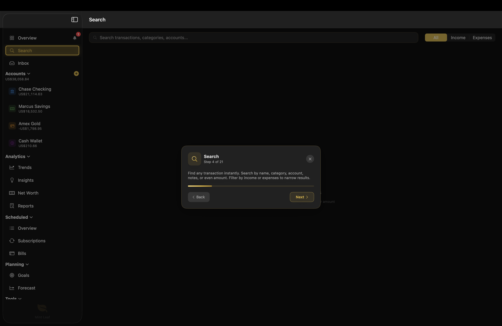 <strong>Search</strong></td>
  </tr>
  <tr>
    <td align="center">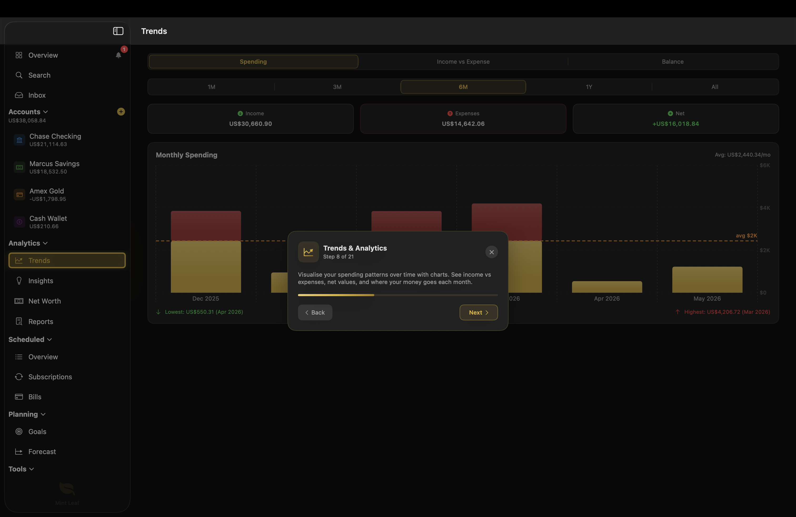 <strong>Trends & Analytics</strong></td>
    <td align="center">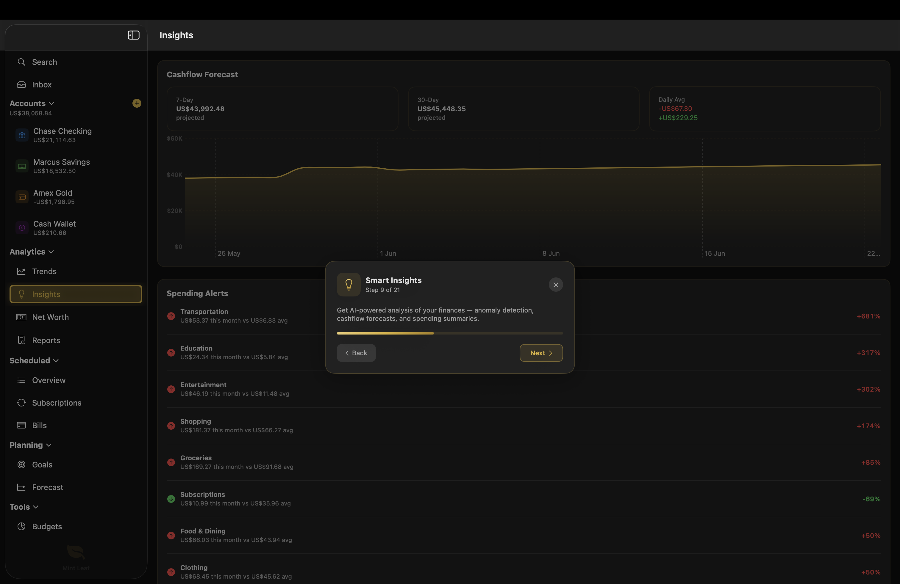 <strong>Smart Insights</strong></td>
  </tr>
  <tr>
    <td align="center">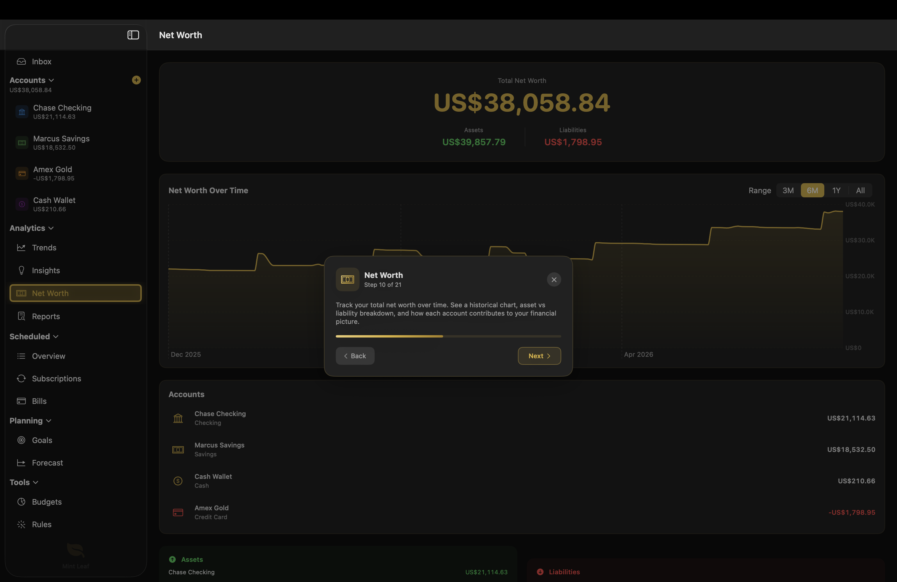 <strong>Net Worth</strong></td>
    <td align="center">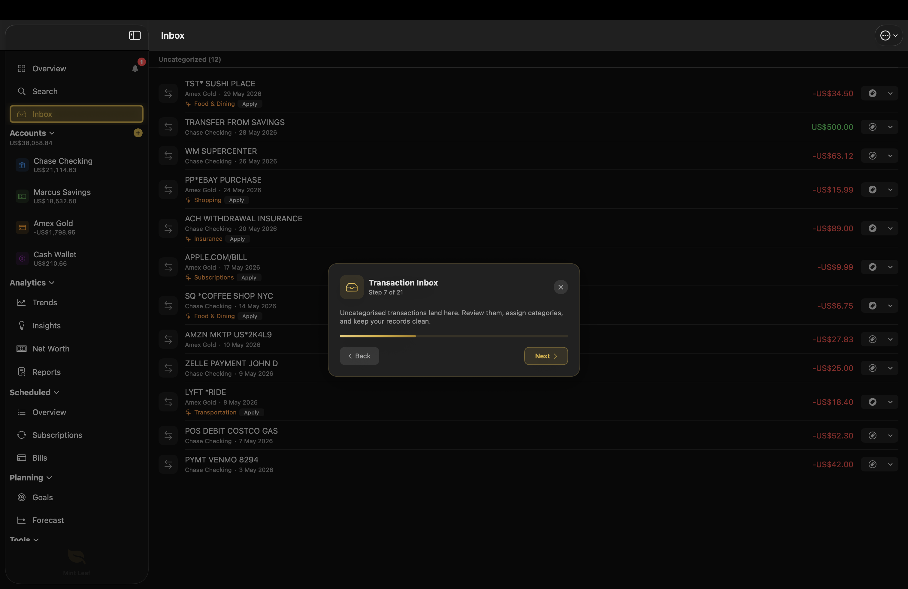 <strong>Transaction Inbox</strong></td>
  </tr>
</table>

### Light Mode

<table>
  <tr>
    <td align="center">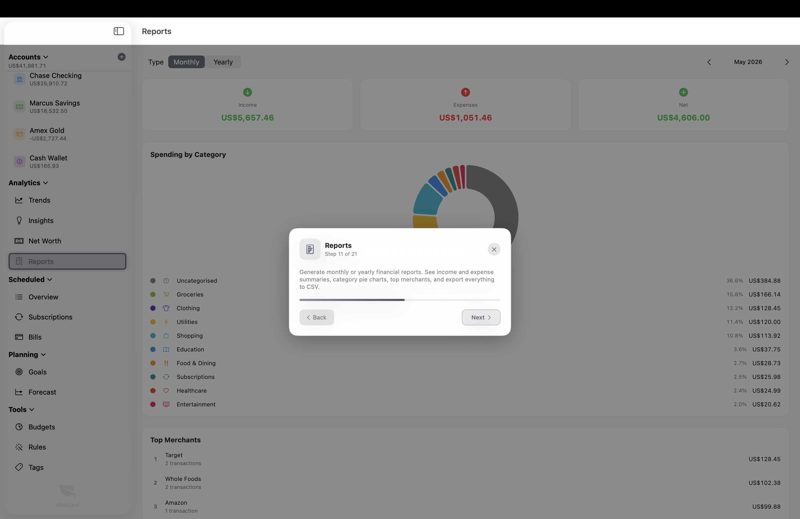 <strong>Reports</strong></td>
    <td align="center">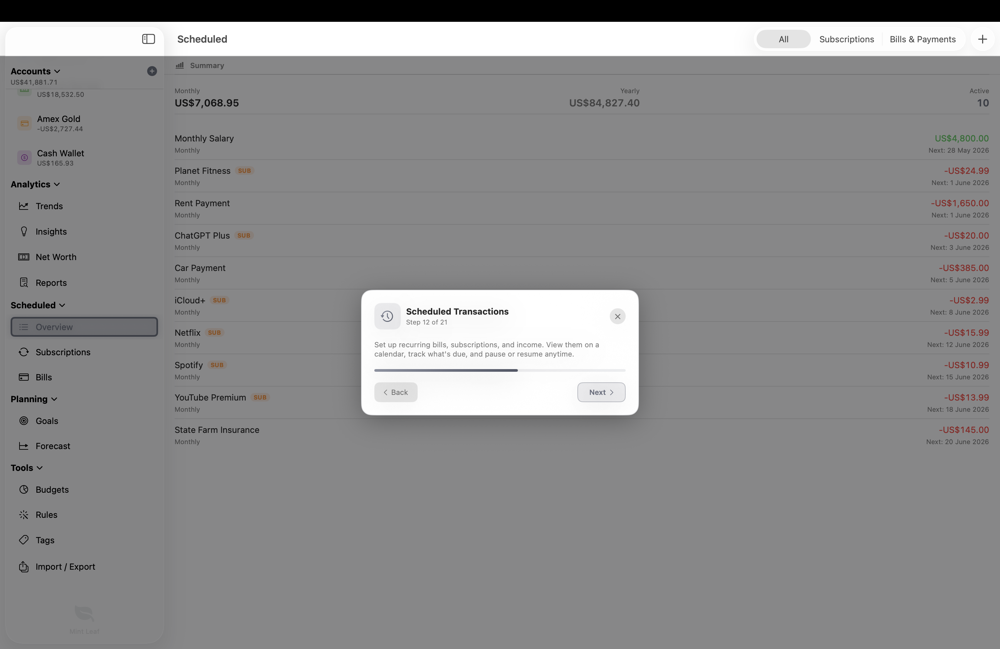 <strong>Scheduled Transactions</strong></td>
  </tr>
  <tr>
    <td align="center">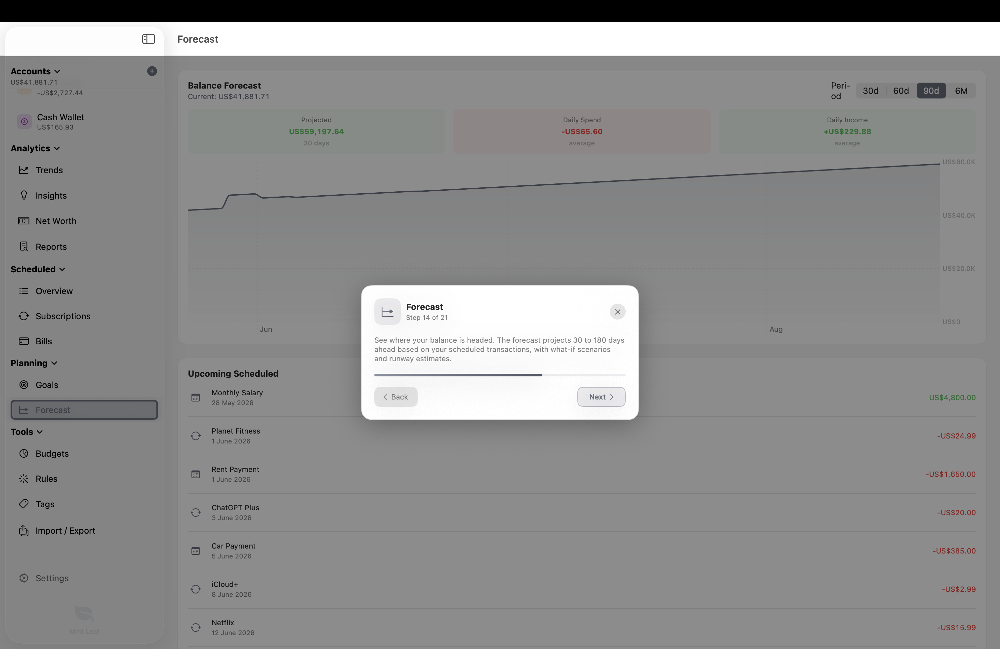 <strong>Forecast</strong></td>
    <td align="center">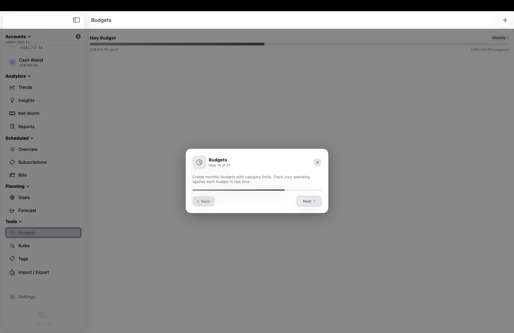 <strong>Budgets</strong></td>
  </tr>
  <tr>
    <td align="center">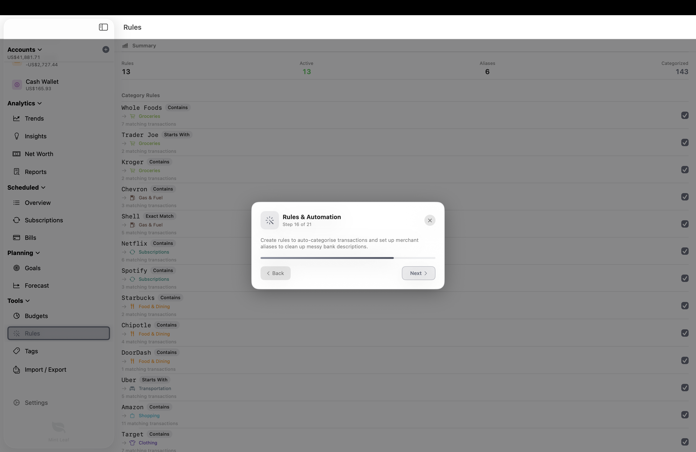 <strong>Rules & Automation</strong></td>
    <td align="center">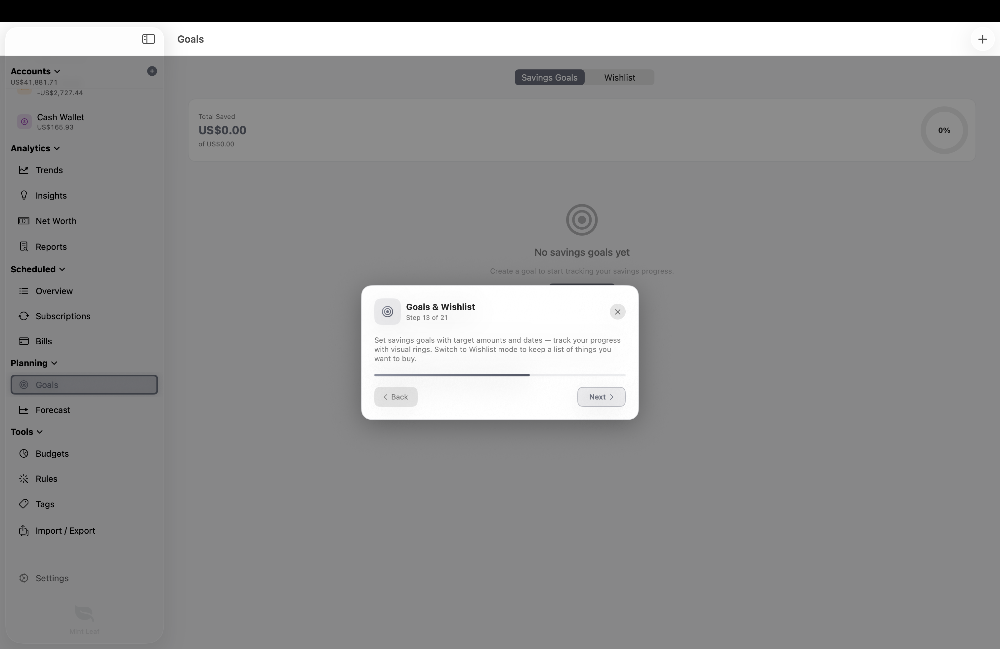 <strong>Goals & Wishlist</strong></td>
  </tr>
</table>

## Installation

### Download DMG (Recommended)

1. Download the latest `.dmg` from [Releases](https://github.com/Kolomaster68/mint-leaf/releases/latest)
2. Open the DMG and drag Mint Leaf to your Applications folder
3. On first launch, right-click the app and select **Open** (macOS Gatekeeper requires this for unsigned apps)

### Build from Source

1. Clone the repository
2. Open `MintLeaf.xcodeproj` in Xcode 16+
3. Select the `MintLeaf_macOS` or `MintLeaf_iOS` scheme
4. Build and run

No external dependencies required.

## Onboarding

New users are guided through a polished onboarding flow with three options:

1. **Start Fresh** — Jump straight into the app
2. **Load Sample Data & Take a Tour** — Explore with demo data and a guided walkthrough
3. **Load Sample Data** — Demo data without the tour

<table>
  <tr>
    <td align="center"> <strong>Welcome</strong></td>
    <td align="center"> <strong>Features Overview</strong></td>
  </tr>
  <tr>
    <td align="center">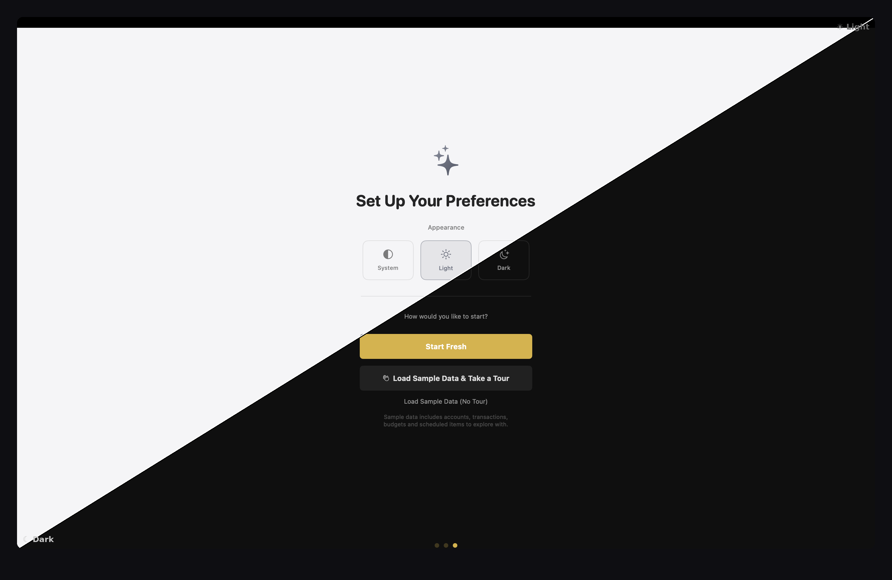 <strong>Setup</strong></td>
    <td align="center">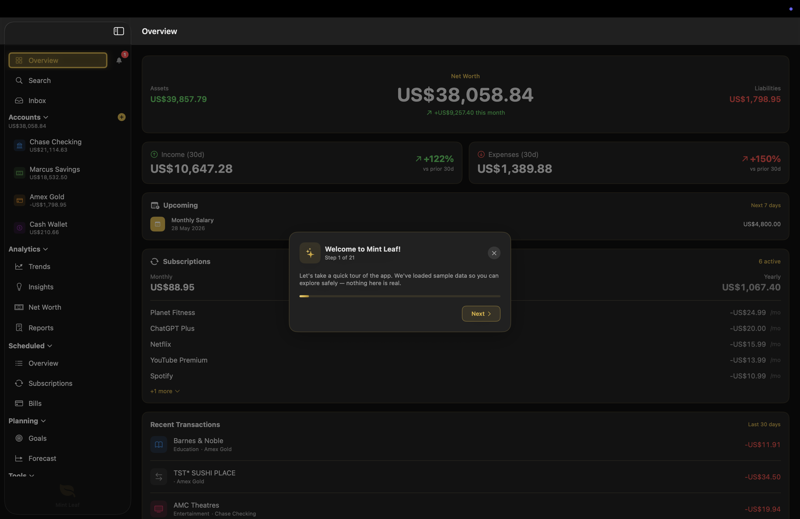 <strong>Guided Tour</strong></td>
  </tr>
  <tr>
    <td align="center">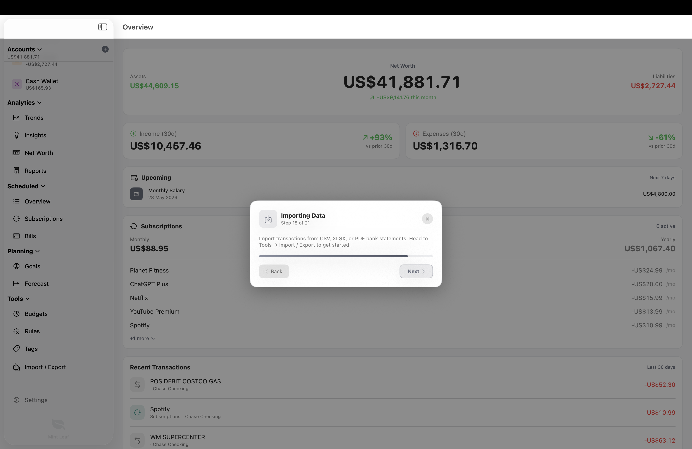 <strong>Tour Step</strong></td>
    <td align="center"> <strong>Tour Complete</strong></td>
  </tr>
</table>

## Keyboard Shortcuts

| Shortcut | Action |
|----------|--------|
| `Cmd+1`–`Cmd+9` | Jump between sections (Overview, Inbox, Trends, Budgets, Scheduled, Insights, Net Worth, Reports, Goals) |
| `Cmd+0` | Tags |
| `Cmd+T` | New Transaction |
| `Cmd+F` | Search |
| `Cmd+B` | Notifications |
| `Shift+Cmd+N` | New Account |
| `Shift+Cmd+E` | Export |

A full, searchable reference is available in **Settings → Shortcuts**.

## App Icon

Mint Leaf ships with both light and dark app icons that match the system appearance. Users can also switch between them manually or upload a custom icon from Settings.

  
  &nbsp;&nbsp;&nbsp;&nbsp;
  

## Tech Stack

| Component | Technology |
|-----------|-----------|
| UI | SwiftUI 5 |
| Data | SwiftData |
| Platform | macOS 14+ / iOS 17+ |
| Language | Swift 6 |
| Architecture | MVVM with @Observable |

## Roadmap

Mint Leaf is under active development. Here's what's been shipped and what's coming next.

### Shipped

| Version | Feature |
|---------|---------|
| v1.0 | Accounts, Transactions, Categories, Budgets |
| v1.0 | CSV & PDF Import |
| v1.0 | Rules & Merchant Aliases |
| v1.0 | Trends & Insights |
| v1.0 | Scheduled Transactions & Subscription Calendar |
| v1.0 | Interactive Onboarding Tutorial |
| v2.0 | Multi-Currency Support (39 currencies) |
| v2.0 | Search with Filters |
| v2.0 | In-App Notification Centre |
| v2.0 | Keyboard Shortcuts |
| v2.0 | Reorganised Sidebar |
| v2.0 | DMG Distribution |
| v2.1 | XLSX (Excel) Import |
| v2.1 | Privacy Dashboard |
| v3.0 | Net Worth Tracker |
| v3.0 | Reports with CSV Export |
| v3.0 | Goals & Wishlist |
| v3.0 | Cashflow Forecast |
| v3.0 | Tags & Tag Picker |
| v3.0 | Transfer Calculation Fix |
| v3.1 | Bank File Import (OFX / QFX / QIF) |
| v3.1 | Financial Health Card |
| v3.1 | Location Tagging |
| v3.1 | Dashboard Customisation |
| v3.1 | Expanded Keyboard Shortcuts |
| v4.0 | Credit Card Statement Cycles & Auto-Reconcile |
| v4.0 | Overdrafts & Fee Estimates |
| v4.0 | Automatic Backups & Backup/Restore |
| v4.0 | Data Health & Reconciliation |
| v4.0 | Account Reordering |

### Coming Next

These features are actively being explored for upcoming releases:

| Feature | Description |
|---------|-------------|
| **Recurring Transaction Detection** | Automatically detect recurring patterns when importing bank statements and suggest scheduled transactions |
| **Split Transactions** | Split a single transaction across multiple categories, people, or accounts for shared expenses |
| **PDF Report Export** | Polished monthly and yearly PDF reports to save or share |
| **On-Device AI** | Smarter statement parsing and natural-language search using Apple's on-device models, with no data leaving your device |

### Future Considerations

| Feature | Notes |
|---------|-------|
| Receipt Scanning | Attach photos or scan receipts to extract amounts |
| Widgets | At-a-glance spending and balance widgets (requires Apple Developer account) |
| Apple Watch | Quick balance checks from your wrist (requires Apple Developer account) |
| Bank Integration | Connect accounts via Plaid or Open Banking |

Have a feature request? [Open an issue](https://github.com/Kolomaster68/mint-leaf/issues).

## Contributing

Contributions are welcome! Fork the repo, create a branch, and submit a pull request. Please keep PRs focused and include a clear description of the change.

## License

MIT License. See [LICENSE](LICENSE) for details.
