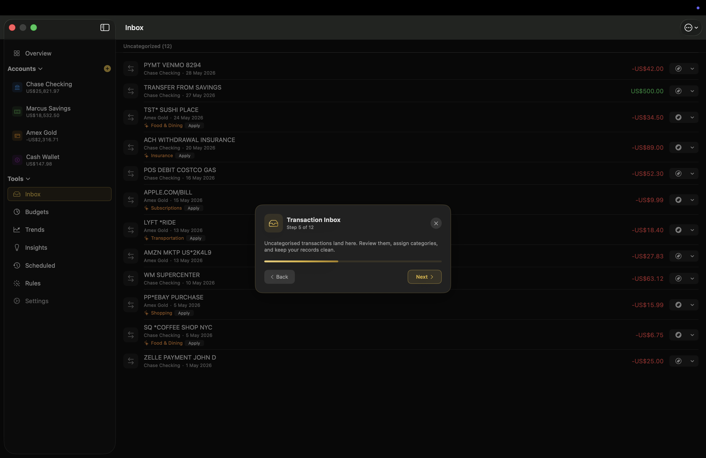
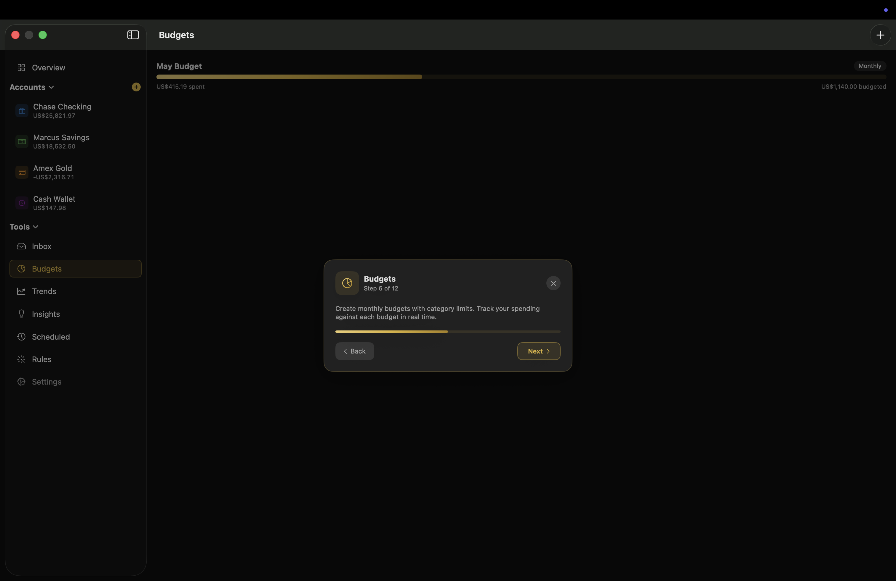
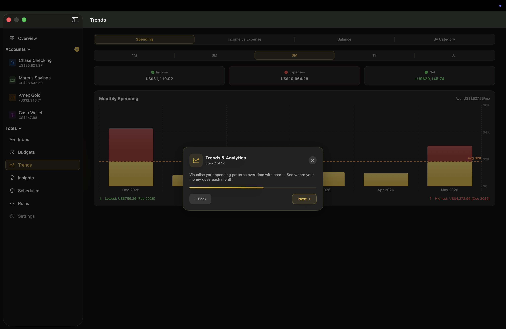
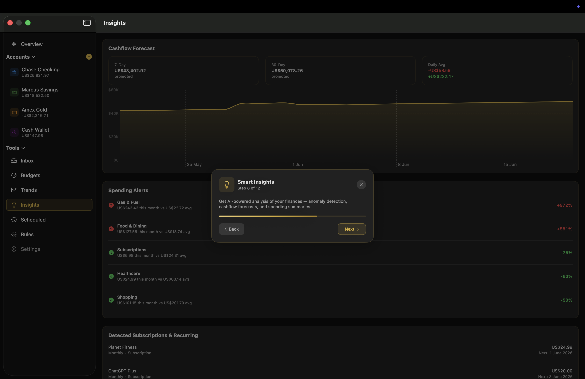
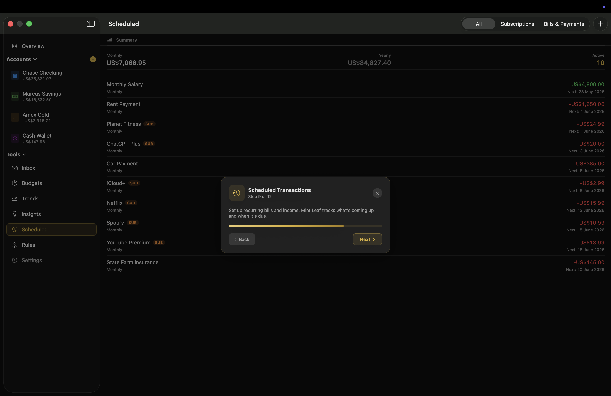
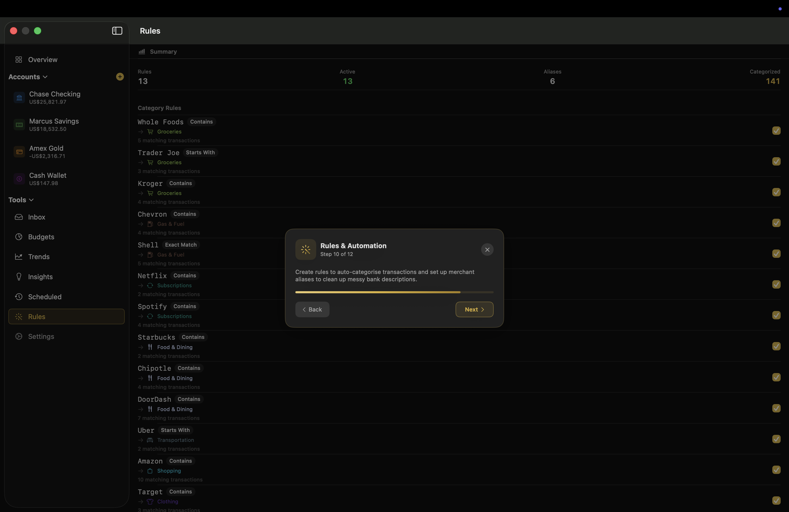
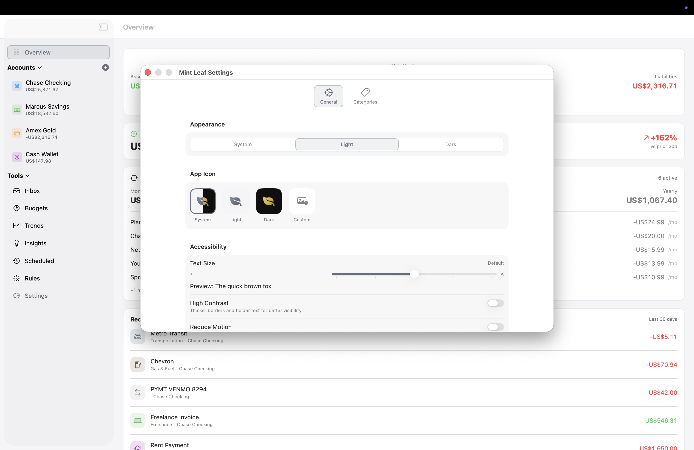

  

<h1 align="center">Mint Leaf</h1>

  <strong>Your personal finance companion.</strong> 
  Track spending, set budgets, and stay in control.

  
  
  
  

## Star History

<a href="https://www.star-history.com/?repos=Kolomaster68%2Fmint-leaf&type=date&legend=top-left">
 <picture>
   <source media="(prefers-color-scheme: dark)" srcset="https://api.star-history.com/chart?repos=Kolomaster68/mint-leaf&type=date&theme=dark&legend=top-left" />
   <source media="(prefers-color-scheme: light)" srcset="https://api.star-history.com/chart?repos=Kolomaster68/mint-leaf&type=date&legend=top-left" />
   
 </picture>
</a>

---

  

## Features

- **Multiple Accounts** — Track checking, savings, credit cards, and cash with live balances
- **Transaction Inbox** — Review and categorise uncategorised transactions in one place
- **Budgets** — Set monthly spending limits by category and track progress in real time
- **Trends & Analytics** — Visualise spending patterns over time with interactive charts
- **Smart Insights** — Cashflow forecasts, anomaly detection, and spending summaries
- **Scheduled Transactions** — Manage recurring bills, subscriptions, and income
- **Rules & Automation** — Auto-categorise transactions with pattern matching and merchant aliases
- **CSV & PDF Import** — Import bank statements from CSV files or PDF documents
- **Interactive Tutorial** — Guided 12-step tour with sample data to learn the app
- **iCloud Sync** — Data syncs seamlessly across all your Apple devices
- **Privacy First** — All data stays on your device and in your iCloud account

## Screenshots

<table>
  <tr>
    <td align="center"> <strong>Transaction Inbox</strong></td>
    <td align="center"> <strong>Budgets</strong></td>
  </tr>
  <tr>
    <td align="center"> <strong>Trends & Analytics</strong></td>
    <td align="center"> <strong>Smart Insights</strong></td>
  </tr>
  <tr>
    <td align="center"> <strong>Scheduled Transactions</strong></td>
    <td align="center"> <strong>Rules & Automation</strong></td>
  </tr>
  <tr>
    <td align="center"> <strong>Settings</strong></td>
    <td align="center"> <strong>Interactive Tutorial</strong></td>
  </tr>
</table>

## Onboarding

New users are guided through a polished onboarding flow with three options:

1. **Start Fresh** — Jump straight into the app
2. **Load Sample Data & Take a Tour** — Explore with demo data and a guided walkthrough
3. **Load Sample Data** — Demo data without the tour

<table>
  <tr>
    <td align="center"> <strong>Feature Overview</strong></td>
    <td align="center"> <strong>Tour Complete</strong></td>
  </tr>
</table>

## App Icon

Mint Leaf ships with both light and dark app icons that match the system appearance. Users can also switch between them manually or upload a custom icon from Settings.

  
  &nbsp;&nbsp;&nbsp;&nbsp;
  

## Tech Stack

| Component | Technology |
|-----------|-----------|
| UI | SwiftUI 5 |
| Data | SwiftData + CloudKit |
| Platform | macOS 14+ / iOS 17+ |
| Language | Swift 5.9+ |
| Sync | iCloud (automatic) |
| Architecture | MVVM with @Observable |

## Building

1. Clone the repository
2. Open `MintLeaf.xcodeproj` in Xcode 15+
3. Select the `MintLeaf_macOS` or `MintLeaf_iOS` scheme
4. Build and run

No external dependencies required.

## Roadmap

Mint Leaf is under active development. Here's what's planned:

| Status | Feature |
|--------|---------|
| :construction: | **Multi-Currency Support** — Live exchange rates and per-account currency |
| :construction: | **Receipt Scanning** — Attach photos or scan receipts with the camera |
| :date: | **Bill Reminders** — Push notifications for upcoming bills and due dates |
| :date: | **Export Reports** — Generate PDF and Excel summaries of your finances |
| :date: | **Widgets** — At-a-glance spending and balance widgets for macOS and iOS |
| :date: | **Shared Budgets** — Collaborate on budgets with family or a partner |
| :date: | **Goal Tracking** — Set savings targets and track progress over time |
| :date: | **Apple Watch App** — Quick balance checks and transaction logging from your wrist |
| :date: | **Bank Integration** — Connect accounts via Plaid or Open Banking APIs |
| :bulb: | **DMG Distribution** — Signed and notarised macOS release for direct download |

:construction: = In Progress &nbsp; :date: = Planned &nbsp; :bulb: = Exploring

Have a feature request? [Open an issue](https://github.com/Kolomaster68/mint-leaf/issues).

## License

MIT License. See [LICENSE](LICENSE) for details.
